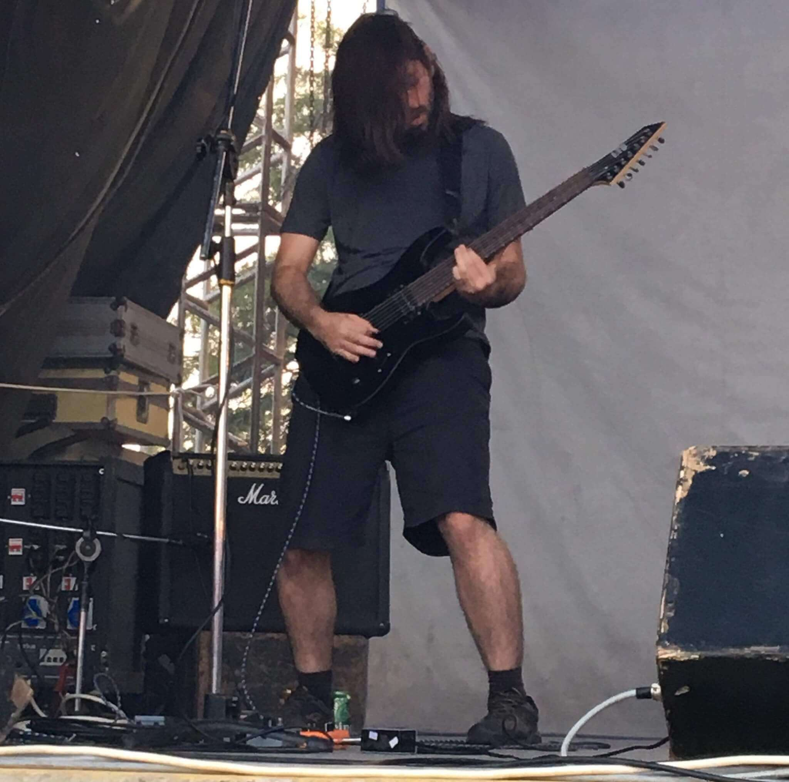

# Thiago Braga

 

Hi, I'm **Thiago Braga**.  
_Aka: Thiagão, Braga, ThiaGod_

 

I have been a programmer since 2009, and during that time
I had contact with several tools and languages.
Some of them:

  
  
  
  
  
  
  
  
  

 

## Some statistics

![Github Stats][github-stats]

[1]: https://github.com/thiagobraga/thiagobraga/issues
[2]: https://raw.githubusercontent.com/thiagobraga/google-calendar-userstyles/master/theme.user.css
[3]: https://raw.githubusercontent.com/thiagobraga/gmail-userstyles/master/theme.user.css
[4]: https://raw.githubusercontent.com/thiagobraga/todoist-userstyles/master/theme.user.css
[5]: https://open.spotify.com/artist/4jThTw7lss5OnXBzwXYFSD
[6]: https://open.spotify.com/artist/6mDkruhCYigOgLPIH9JJ0K
[github-stats]: https://github-readme-stats.vercel.app/api?username=thiagobraga&show_icons=true&theme=nord&count_private=true
